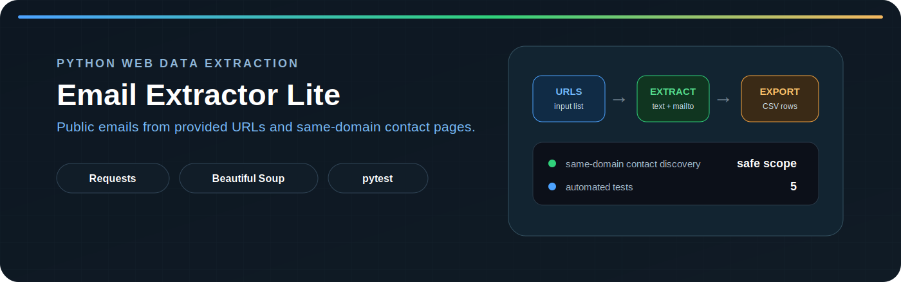
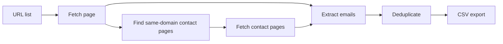

<p align="center">
  
</p>

<p align="center">
  
  
  
  
</p>

# Email Extractor Lite

A focused Python CLI tool that extracts publicly visible email addresses from a list of URLs and selected same-domain contact pages, deduplicates the results, and exports them to CSV.

The project is intentionally small, but it demonstrates a complete extraction workflow: input handling, reliable HTTP requests, HTML parsing, contact-page discovery, normalization, deduplication, structured export, and automated regression tests.

## What it does

| Stage | Behavior |
|---|---|
| Input | Reads one public URL per line from a text file |
| Fetch | Requests each page with a timeout and HTTP error handling |
| Extract | Finds emails in visible text and `mailto:` links |
| Discover | Follows contact/about/impressum links on the same domain |
| Deduplicate | Keeps each normalized email once across the full run |
| Export | Writes structured results to a UTF-8 CSV file |

## Key features

- Extracts emails from visible page text and `mailto:` links
- Discovers common contact pages such as `/contact`, `/about`, and `/impressum`
- Restricts discovered contact links to the original domain
- Skips `mailto:` and `tel:` links during page discovery
- Normalizes emails to lowercase and removes duplicates
- Handles request failures without stopping the full run
- Avoids creating a misleading empty CSV when no emails are found
- Includes automated tests for extraction, fetching, crawling, and CSV output

## Pipeline



## Output schema

| Column | Description |
|---|---|
| `source_url` | Page where the email was found |
| `email` | Normalized email address |
| `email_type` | `visible_text` or `mailto` |
| `found_in` | `page_text` or `mailto_href` |
| `checked_at` | ISO-formatted extraction timestamp |

Example:

```csv
source_url,email,email_type,found_in,checked_at
https://example.com/contact,info@example.com,visible_text,page_text,2026-07-15T12:30:00
```

## Installation

Clone the repository and create a virtual environment:

```bash
git clone https://github.com/Mr-sanabi/email-extractor-lite.git
cd email-extractor-lite
python -m venv .venv
```

Activate it on Windows:

```powershell
.venv\Scripts\Activate.ps1
```

Install runtime dependencies:

```bash
python -m pip install -r requirements.txt
```

## Usage

Create a text file with one URL per line:

```text
https://example.com
https://example.org
```

Run the package from the repository root:

```bash
python -m src.main data/urls.txt data/emails.csv
```

Show CLI help:

```bash
python -m src.main --help
```

If the input file is missing, no usable URLs are provided, or no emails are found, the tool exits without producing a misleading output file.

## Testing

Install development dependencies:

```bash
python -m pip install -r requirements-dev.txt
```

Run the full test suite:

```bash
python -m pytest -q
```

The current suite covers:

- visible-text and `mailto:` extraction
- email normalization, metadata, and deduplication
- same-domain contact-link filtering
- multi-URL processing
- request failure handling with `monkeypatch`
- CSV writing and round-trip validation

## Project structure

```text
email-extractor-lite/
├── data/
│   └── .gitkeep
├── src/
│   ├── extractor.py
│   ├── fetcher.py
│   ├── main.py
│   ├── scraper.py
│   └── storage.py
├── tests/
│   ├── test_extractor.py
│   ├── test_fetcher.py
│   ├── test_scraper.py
│   └── test_storage.py
├── .gitignore
├── README.md
├── requirements-dev.txt
└── requirements.txt
```

## Module responsibilities

| Module | Responsibility |
|---|---|
| `src/main.py` | CLI arguments, URL loading, and pipeline orchestration |
| `src/fetcher.py` | HTTP requests, timeout, and request error handling |
| `src/extractor.py` | Email extraction and same-domain contact discovery |
| `src/scraper.py` | Multi-page workflow and global email deduplication |
| `src/storage.py` | CSV serialization |
| `tests/` | Regression tests for the main behaviors |

## Limitations

- Processes server-rendered HTML; it does not execute JavaScript
- Does not decode deliberately obfuscated email addresses
- Visits only supplied URLs and discovered contact-related pages
- Does not include retries, rate limiting, or proxy rotation
- Uses a practical regex, not a complete RFC email parser

## Responsible use

Use this tool only on public pages you are authorized to inspect. Respect each website's terms, `robots.txt`, rate limits, privacy rules, and applicable anti-spam laws.

The tool does not guess addresses, bypass authentication, access private data, or use third-party lead databases.
